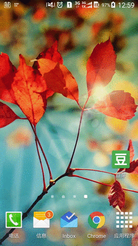
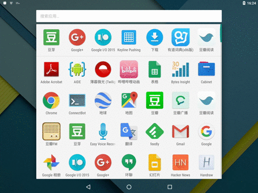

# MaterialColdStart

Utilize the window background during cold start time (the time between user launches your app and `Activity.onCreate()` is called) to make your app look faster.

This project comes with some templates for Material Designed apps, but you can also roll your own if you wish.

## Preview

Blank cold start (Glitch on status bar and appbar) v.s. Material cold start (Preserves visual consistency):




(I deliberately picked a slower device to show the effect clearer, but this improvement is also delightful on faster devices.)

When your app process is cached in memory but main activity is relaunched, this technique gives the illusion of a much quicker start up.



Notice the small period of time when appbar and status bar is "drawn" but no text is shown — _this is the trick_. Without the help of our cold start window background, users will see a glitch of whiteness over the appbar and statusbar.

## Inspiration

This project was inspired by the pro-tip [Use cold start time effectively with a branded launch theme — Pro-tip by +Ian Lake](https://plus.google.com/+AndroidDevelopers/posts/Z1Wwainpjhd).

But instead of using a short transient product logo as preview, I want to use a background with an `AppBar` on it, just like the old days with framework-managed `ActionBar`, which gives user the illusion of a quicker start up and ensures visual consistency.

This project has been around in my mind for several months, until I found my way to generate drawables with templates.

## Implementation

This project generates nine-patch drawables for use as `android:windowBackground`.

### Why nine-patch?

Only static drawables can be loaded by framework as preview, and all other drawables will only retain aspect ratio when width/height is set. So we need to use nine-patch.

### How to generate nine-patch?

However, nine-patches need to be bitmaps, but we have various dimension sizes changing with configuration, and we still have to retain the one-pixel border while scaling up the content area.

I don't want to keep a separate file for each combination of configuration (which can be 20 if you support tablet), but instead use a single template for nine-patch generation. After a lot of (painful) trial-and-error with `XSLT` and `sed`, I suddenly found the good old `bash` (which is string-oriented) a viable solution for this problem.

The solution, a "new" format called `shsvg` (Shell SVG), is implemented as in [DreaminginCodeZH/AndroidSVGScripts](https://github.com/DreaminginCodeZH/AndroidSVGScripts) and used by this project.

## Usage

> Note: To generate your own image assets, you will probably need a Linux installation. I may upload some pre-built assets later.

1. Modified the `.conf` files to reflect the layout of your main activity. You can set some of the values to `0` so that the corresponding area will be hidden.

2. Run `gen-png.sh` and copy the output in `gen/` to your `res` directory. (requires `bash`, `inkscape` and `gcalccmd`(from `gnome-calculator`))

3. Make a new theme for your main activity:

    ```xml
    <style name="AppTheme.MaterialColdStart">
        <item name="android:windowBackground">@drawable/window_background_statusbar_toolbar_tab</item>
    </style>
    ```

4. And set the new theme in your `AndroidManifest.xml`:

    ```xml
    <activity
        android:name=".MainActivity"
        android:theme="@style/AppTheme.ColdStart">

        <intent-filter>
            <action android:name="android.intent.action.MAIN" />
            <category android:name="android.intent.category.LAUNCHER" />
        </intent-filter>
    </activity>
    ```

5. Finally in your `MainActivity.java`, set the theme back for the normal window background, which will be transitioned into:

    ```java
    public class MainActivity extends AppCompatActivity {

        @Override
        protected void onCreate(Bundle savedInstanceState) {

            // Make sure this line comes before calling super.onCreate().
            setTheme(R.style.AppTheme);

            super.onCreate(savedInstanceState);
        }
    }
    ```

6. Enjoy the updated cold start experience!

## Pre-built assets

// TODO

## License

```
Copyright (c) 2015 Zhang Hai <Dreaming.in.Code.ZH@Gmail.com>

This program is free software: you can redistribute it and/or modify
it under the terms of the GNU General Public License as published by
the Free Software Foundation, either version 3 of the License, or
(at your option) any later version.

This program is distributed in the hope that it will be useful, but
WITHOUT ANY WARRANTY; without even the implied warranty of
MERCHANTABILITY or FITNESS FOR A PARTICULAR PURPOSE.  See the GNU
General Public License for more details.

You should have received a copy of the GNU General Public License
along with this program.  If not, see
<http://www.gnu.org/licenses/>.
```
